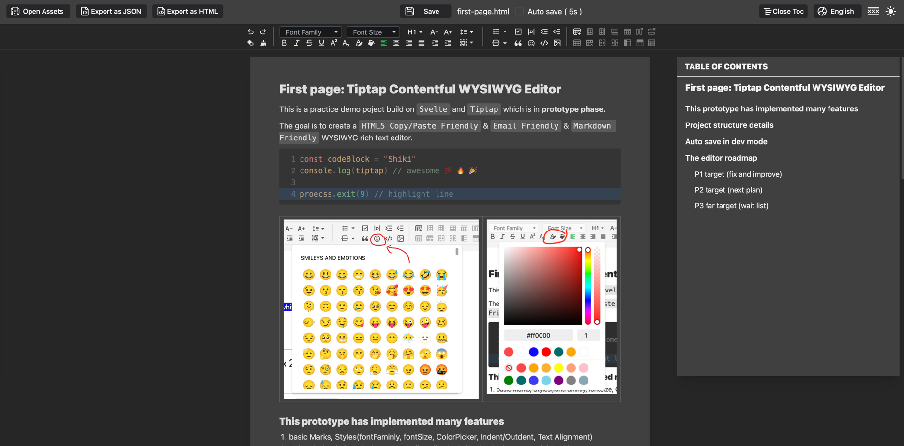

# TipTap Contentful Example

## [[简体中文]](./README.zh.md) | [[Playground & Articles]](https://tiptiz.github.io/editor)




This is a practice project for exploring `Svelte` and `Tiptap` to create a `WYSIWYG` rich text editor.
Yeah, this project is **in prototype phase**.🤣

This project's final goal is to be able to be a `HTML5 Copy/Paste Friendly` & `Email Friendly` & `Markdown Friendly`
feature rich WYSIWYG rich text editor.

## [Goto GitHub.io Playground for the details](https://tiptiz.github.io/editor)

I wrote a post on this demo page to show how I built it. Hopefully, it can help you, and I'm very grateful for your
feedback.

1. basic Marks, Styles(fontFamily, fontSize, ColorPicker, Indent/Outdent, Text Alignment)
2. BulletList/TaskList, Blockquote, Emojis, InlineCode/Code Block, Image, Link, Table...
3. nice toolbars with manually adjusted svg icons (thanks [iconify](https://icon-sets.iconify.design/))
4. table of contents with quick navigation jump
5. builtin light i18n system
6. (dev mode) assets auto save and assets sidebar, deploy to github.io by CI/CD in production

❗️❗️❗ This project is still in the prototype phase, and there are still many features to be implemented. If you have any
suggestions or ideas, please feel free to open an issue (Currently PR not welcome)🙏     
❗️❗️❗ And be careful while saving content, there is no swap file yet.

## Editor feature compatible tables (new)

Goto collection issue for details: https://github.com/aolyang/tiptap-contentful/issues/29

+ current practice status:  
  ✅ supported; ❌ not support; ⏳ working on; 🚧 planning;
+ other editors status (mainly paste to):  
  🆗 partially support; 📋 paste support;

| features     | markdown | 微信公众号 | 知乎 | 掘金富文本 |
|--------------|----------|-------|----|-------|
| bold         | ✅        | ✅     | ✅  | ✅     |
| italic       | ✅        | ✅     | ✅  | ✅     |
| inline code  | ✅        | ✅     | ✅  | ✅     |
| strike       | ✅        | ✅     | ✅  | ❌     |
| superscript  | ✅        | ❌     | ✅  | ❌     |
| subscript    | ✅        | ❌     | ✅  | ❌     |
| underline    | ✅        | ✅     | ✅  | ✅     |
| fontFamily   | ❌        | ✅     | ❌  | ❌     |
| fontSize     | ❌        | ✅     | ❌  | ❌     |
| HeadingLevel | ✅        | ✅     | ❌  | ✅     |
| link         | ✅        | ❌     | ✅  | ✅     |
| blockquote   | ✅        | ✅     | ✅  | ✅     |
| fontColor    | ❌        | ✅     | ❌  | ❌     |
| bgColor      | ❌        | ✅     | ❌  | ❌     |
| Hr           | ✅        | ✅     | ✅  | ❌     |
| BulletList   | ✅        | ✅     | ✅  | ✅     |

## ~~Editor features (Improving~~)

+ current practice status:  
  ✅ supported; ❌ not support; ⏳ working on; 🚧 planning;
+ other editors status:  
  🆗 partially support; 📋 paste support;

| features               | current practice | we-chat editor  |
|------------------------|------------------|-----------------|
| undo/redo              | ✅                | ✅               |
| clear marks            | ✅                | ✅               |
| heading                | ✅                | ❌ 📋            |
| fontFamily             | ✅                | ❌ 📋            |
| fontSize               | ✅                | 🆗 (options) 📋 |
| bold                   | ✅                | ✅               |
| italic                 | ✅                | ✅               |
| underline              | ✅                | ✅               |
| strike                 | ✅                | ✅               |
| Sup/sub                | ✅                | ❌ 📋            |
| font-color             | ✅                | ✅               |
| background-color       | ✅ (mark)         | ✅               |
| clear color/bg only    | ✅                | ✅               |
| alignment              | ✅                | ✅               |
| indent                 | ✅                | ✅               |
| line-height            | ✅                | ✅               |
| paragraph margin       | ✅                | ✅               |
| Emoji                  | ✅                | ✅               |
| list                   | ✅                | ✅               |
| TaskList               | ✅                | ❌               |
| list lift/sink         | ✅                | ✅ (margin)      |
| Table                  | ✅                | ❌               |
| Table Head/Cell Toggle | ✅                | ❌ 📋            |
| Table Cell Merge/Split | ✅                | ❌ 📋            |
| Table Row Add/Delete   | ✅                | ❌ 📋            |
| Table Col Add/Delete   | ✅                | ❌ 📋            |
| block-quote            | ✅                | ❌ 📋            |
| code-block             | ✅                | ✅ 📋 (paste)    |
| image                  | ✅                | ✅               |

## Internal classes table (Not done yet)

To compact with other rich text editors, I'm try my best to use inline style.
But using classes to style the editor is can not be avoided. So here is the classes table I'm using in this editor

+ ✅ used classes
+ ❌ not support

| internal classes   | extension            | current | we-chat |
|--------------------|----------------------|---------|---------|
| list-paddingleft-1 | taskList, bulletList | ✅       | ✅       |

## Project structure

This project is a monorepo based on pnpm workspaces.

+ `packages/*`: customized extensions.
+ `example`: this demo page.
+ `example/dev-server.mjs`: provide `/content` api, and serve vite (as middleware mode).
+ `src/App.svelte`: Page layout (editor, toolbars), Editor state context
+ `src/icons/toolbars`: all toolbar SVG icons here are modified to look the same size and support svelte.
+ `src/icons/*`: other SVG icons.
+ `src/components/ui`: shadcn-svelte components, you can see the details in `src/components.josn`
+ `src/components/Toolbar.svelte`: toolbar entry component.
+ `src/components/toolbars/*.svelte`: all toolbar and editor features implemented here.
+ `src/states/*.svelte.ts`: global shared states. (editor state, theme, color picker histories ...)
+ `src/assets/noto-emojis-v16.json`: Google NotoEmoji metadata json file.
+ `public/NotoColorEmoji.ttf`: Google NotoEmoji font file.

## Run this Project

This project based on `Node 21.7.3`, I personally recommend using [fnm](https://github.com/Schniz/fnm) to manager your
node version.

```bash
> git clone https://github.com/tiptiz/editor.git --depth=1
> cd tiptap-contentful
> fnm install/use # optional
> pnpm install
> cd exmaple 
> node dev-server.mjs # also pnpm server, or you can't use local save
```
